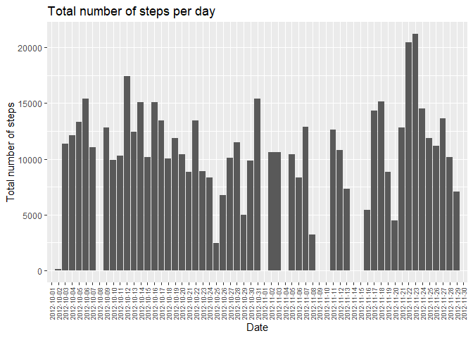
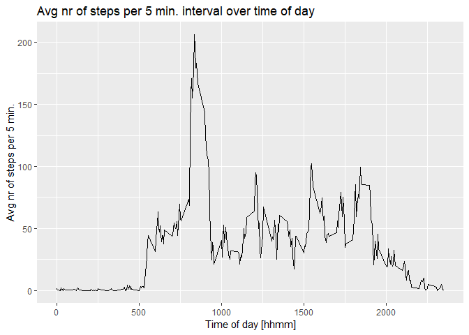
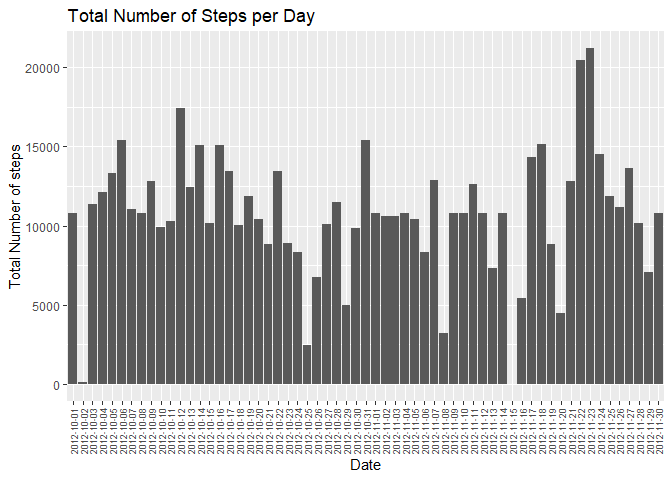
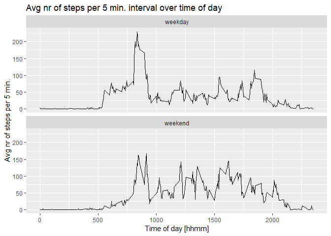

### Kenneth Kronkvist, March 6, 2019

This assignment makes use of data from a personal activity monitoring device. The data consists of data collected during October and November, 2012 and include the number of steps taken in 5 minute intervals each day.

## Loading and preprocessing the data


```r
if (!file.exists("activity.csv")){
     fileurl <- "http://d396qusza40orc.cloudfront.net/repdata%2Fdata%2Factivity.zip" 
     download.file(fileurl,"Activity.zip", method = "curl")  
     unzip("Activity.zip")
    }
activity <- read.csv("activity.csv")  
```

## What is mean total number of steps taken per day?

### 1. Calculate the total number of steps taken per day


```r
str(activity)
```

```
## 'data.frame':	17568 obs. of  3 variables:
##  $ steps   : int  NA NA NA NA NA NA NA NA NA NA ...
##  $ date    : Factor w/ 61 levels "2012-10-01","2012-10-02",..: 1 1 1 1 1 1 1 1 1 1 ...
##  $ interval: int  0 5 10 15 20 25 30 35 40 45 ...
```

```r
head(activity)
```

```
##   steps       date interval
## 1    NA 2012-10-01        0
## 2    NA 2012-10-01        5
## 3    NA 2012-10-01       10
## 4    NA 2012-10-01       15
## 5    NA 2012-10-01       20
## 6    NA 2012-10-01       25
```

```r
# summing steps per date
stepsDay <- with(activity, tapply(steps, date, sum, na.rm = T))
head(stepsDay)
```

```
## 2012-10-01 2012-10-02 2012-10-03 2012-10-04 2012-10-05 2012-10-06 
##          0        126      11352      12116      13294      15420
```

### 2. Make a histogram of the total number of steps taken each day


```r
# Suppress warnings globally (I will turn it back on at the end)
options(warn = -1)

library(ggplot2)
ggplot(activity, aes(date, steps)) + 
        geom_histogram(stat = "identity") + 
        theme(axis.text.x = element_text(size = 7, angle = 90, vjust = 0.5)) +
        labs(title = "Total number of steps per day", 
             x = "Date", y = "Total number of steps")
```

<!-- -->

### 3. Calculate and report the mean and median of the total number of steps taken per day


```r
mean(stepsDay)     # mean steps per day of period 2012-10-01 to 2012-11-30
```

```
## [1] 9354.23
```

```r
median(stepsDay)   # median steps per day of period 2012-10-01 to 2012-11-30
```

```
## [1] 10395
```

## What is the average daily activity pattern?

### 1. Make a time series plot of the 5-minute interval and the average number of steps taken, averaged across all days


```r
# We calculate the average of steps per interval
intervalAvg <- aggregate(steps ~ interval, activity, 
        FUN = function(x) {mean(x, na.rm = TRUE)})
head(intervalAvg)
```

```
##   interval     steps
## 1        0 1.7169811
## 2        5 0.3396226
## 3       10 0.1320755
## 4       15 0.1509434
## 5       20 0.0754717
## 6       25 2.0943396
```

```r
ggplot(intervalAvg, aes(interval, steps)) + geom_line() + 
        labs(title = "Avg nr of steps per 5 min. interval over time of day", 
             x = "Time of day [hhmm]", y = "Avg nr of steps per 5 min.")
```

<!-- -->

### 2. Which 5-minute interval, on average across all the days in the dataset, contains the maximum number of steps?

The interval at time 8:35am to 8:40am has the highest average of steps = 206:


```r
intervalAvg$interval[which.max(intervalAvg$steps)]
```

```
## [1] 835
```

```r
max(intervalAvg$steps)
```

```
## [1] 206.1698
```

## Imputing missing values

### 1. Calculate and report the total number of missing values in the dataset (i.e. the total number of rows with NAs)


```r
sum(is.na(activity))
```

```
## [1] 2304
```

### 2. Devise a strategy for filling in all of the missing values

For filling in the missing values we will use the mean of the specific 5-minute interval in which the observation is missing.

### 3. Create a new dataset that is equal to the original dataset but with the missing data filled in.


```r
for (i in 1:length(activity$steps)) {   # 1:17568
        if (is.na(activity[i, 1])) {    # if step value missing (NA) then...
                # ...we get the average steps for the specific interval 
                stepsAvg <- subset(intervalAvg,
                        # when intervalAvg$interval == activity$interval
                        intervalAvg$interval == activity[i, 3])$steps
                # ...and replace the value
                activity[i, 1] <- stepsAvg
        } else {
                activity[i, 1] <- activity[i, 1]
        }
        activity
}
head(activity)
```

```
##       steps       date interval
## 1 1.7169811 2012-10-01        0
## 2 0.3396226 2012-10-01        5
## 3 0.1320755 2012-10-01       10
## 4 0.1509434 2012-10-01       15
## 5 0.0754717 2012-10-01       20
## 6 2.0943396 2012-10-01       25
```

### 4. Make a histogram of the total number of steps taken each day and Calculate and report the mean and median total number of steps taken per day. What is the impact of imputing missing data on the estimates of the total daily number of steps?


```r
ggplot(activity, aes(date, steps)) + 
        geom_histogram(stat="identity") + 
        theme(axis.text.x= element_text(size=7, angle=90, vjust = 0.5)) +
        labs(title = "Total Number of Steps per Day", 
             x = "Date", y = "Total Number of steps")
```

<!-- -->

```r
stepsDayNew <- with(activity, tapply(steps, date, sum, na.rm = T))
mean(stepsDayNew)
```

```
## [1] 10766.19
```

```r
median(stepsDayNew)
```

```
## [1] 10766.19
```

After imputing missing data the mean steps per day has increased from 9354 to 10766
and median has increased from 10395 to 10766.

## Are there differences in activity patterns between weekdays and weekends?

### 1. Create a new factor variable in the dataset with two levels - "weekday" and "weekend" indicating whether a given date is a weekday or weekend day.


```r
library(dplyr)
```

```
## 
## Attaching package: 'dplyr'
```

```
## The following objects are masked from 'package:stats':
## 
##     filter, lag
```

```
## The following objects are masked from 'package:base':
## 
##     intersect, setdiff, setequal, union
```

```r
# We create a new column with day-names of the week.
# But first, activity$date must be stored as POSIXct
activity$date <- as.Date(activity$date, "%Y-%m-%d")
activity <- mutate(activity, day = weekdays(date))

# We make activity$day to a factor variable with 2 levels: weekday and weekend
for (i in 1:length(activity$day)) {
        # we replace "Saturday" with "weekend"
        if (activity[i, 4] == "Saturday") {
                activity[i, 4] <- "weekend"
        } # we replace "Sunday" with "weekend"
        else if (activity[i, 4] == "Sunday") {
                activity[i, 4] <- "weekend"
        } # we replace Mo, Tue, We, Thu, Fri with "weekday"
        else {
                activity[i, 4] <- "weekday"
        }
}
activity$day <- as.factor(activity$day)
str(activity)
```

```
## 'data.frame':	17568 obs. of  4 variables:
##  $ steps   : num  1.717 0.3396 0.1321 0.1509 0.0755 ...
##  $ date    : Date, format: "2012-10-01" "2012-10-01" ...
##  $ interval: int  0 5 10 15 20 25 30 35 40 45 ...
##  $ day     : Factor w/ 2 levels "weekday","weekend": 1 1 1 1 1 1 1 1 1 1 ...
```

### 2  Make a panel plot containing a time series plot of the 5min interval and the average number of steps taken, averaged across all weekday days and weekend days. 


```r
# We calculate the average of steps per interval 
# -> we need to group by interval and day (weekday/weekend).
# We don't need date column for plotting
intervalAvgWeek <- aggregate(activity$steps,
                        # a list of grouping elements
                        list(interval = activity$interval, day = activity$day)
                        # summary function of aggrgate()
                        , mean)

# We need to add back the name "steps" that got lost with aggregate()
names(intervalAvgWeek) <- c("interval", "day", "steps")
str(intervalAvgWeek)
```

```
## 'data.frame':	576 obs. of  3 variables:
##  $ interval: int  0 5 10 15 20 25 30 35 40 45 ...
##  $ day     : Factor w/ 2 levels "weekday","weekend": 1 1 1 1 1 1 1 1 1 1 ...
##  $ steps   : num  2.251 0.445 0.173 0.198 0.099 ...
```

```r
# Plot using ggplot2
ggplot(intervalAvgWeek, aes(interval, steps)) + geom_line() + 
        facet_wrap(~day, ncol = 1) + 
        labs(title = "Avg nr of steps per 5 min. interval over time of day",
             x = "Time of day [hhmm]", y = "Avg nr of steps per 5 min.")
```

<!-- -->

```r
options(warn = 0)
```

Conclusion: during weekdays the number of average steps are higher in the morning (5am to 9:30am) and lower the rest of the day, compared to weekends (except for the weekday peak around 6pm after work)

